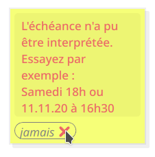

# IHM - Gestionnaire de pense-bêtes

Auteurs :
- Gildas HOULMANN
- Thibaud FRANCHETTI

Répertoire Github : [https://github.com/ChatDeBlofeld/IHM_Projet1](https://github.com/ChatDeBlofeld/IHM_Projet1)

## Introduction

Pour notre application de gestion de pense-bêtes, nous sommes partis d'une impression, celle que la source d'erreurs la plus importante pour une personne âgée est la longueur de la procédure nécessaire à l'accomplissement d'une tâche. 

De plus, notre public cible n'est généralement pas habitué à ce qui représente pour nous une interface graphique standard (menus masqués, onglets, messages pop-up, ...), nous obligeant à plus nous rapprocher du monde réel.

Ce constat n'a rien de scientifique et n'est bien entendu pas limité aux représentants du 3e âge (pensons par exemple aux sites d'e-commerce qui recherchent à minimiser le nombre d'étapes pour acheter un produit), mais c'est néanmoins avec ces idées en tête que nous avons pensé notre application.

Enfin, pour apporter une réelle plus-value à l'utilisation d'un service numérique, nous avons ajouté un système de rappels qui alertera l'utilisateur au moment voulu.

## Eléments de l'application
### Fenêtre principale

L'application se compose d'une seule fenêtre, sans boutons ni menus, dans le but de pousser au maximum le rapprochement avec notre modèle conceptuel (un tableau rempli de notes manuscrites épinglées).

Elle est ainsi prévue pour s'exécuter sur des écrans d'une certaine taille, si possible tactiles (tablettes, ordinateurs 2-en-1, ...) car la majorité des interactions se font à l'aide du glisser-déposer.

Elle se compose d'un grand espace pour y disposer les nouvelles notes ainsi que de trois éléments, sur lesquels nous reviendront, qui suffisent à toutes les actions prévues :

- La pile de pense-bêtes
- Le curseur de mise à l'échelle
- La croix de destruction

### Pile de pense-bêtes

Elle permet de générer autant de notes que nécessaire. Aussi simplement que l'on prendrait un pense-bête sur le haut de la pile dans la réalité, il est possible de glisser une note à l'endroit que l'on souhaite.

Les différentes notes sous la première sont là pour suggérer que si l'on déplace le premier pense-bête, d'autres sont disponibles dessous. Le but est de créer une affordance suffisamment forte pour qu'il soit intuitif de créer des notes tout utilisant le moins possible d'éléments d'interface.

### Curseur de mise à l'échelle

Pour nous il s'agit d'un point important que de disposer d'un zoom accessible. C'est une demande récurrente parmi notre entourage que d'adapter la taille de certains éléments, opération qui n'est pas toujours simple à réaliser, y compris pour nous.

Le curseur de mise à l'échelle ne peut pas être couvert par une note afin de garantir que l'action "zoomer" soit bien découvrable quel que soit l'état de l'application.

### Croix de destruction

Les pense-bêtes étant souvent éphémères, il est important de pouvoir les détruire simplement. Aussi avons-nous opté pour un objet au signifiant que nous espérons totalement univoque. 

La croix s'agrandit lorsque l'on y approche suffisemment un pense-bête, afin de fournir un retour clair sur l'action qui va suivre.

Une fois détruite, une note ne l'est bien sûr pas vraiment (mécanique de *undo*). Il nous semblait cependant essentiel qu'un pense-bête détruit par erreur ne disparaîsse pas de l'interface, au risque que l'utilisateur ne sache pas où aller pour le retrouver. C'est pourquoi les notes supprimées s'empilent sous la croix de destruction est peuvent être récupérées par une action de glisser-déposer.

### Pense-bête

Le pense-bête est sans conteste la structure la plus complexe mais aussi la plus centrale. C'est pourquoi nous y avons apporté un soin tout particulier.

Nous avons supposé que l'affordance fait que pour éditer une note, il doit être possible de cliquer dessus et d'écrire. C'est également un effort de cohérence par rapport à la création de notes, qui s'effectue de cette manière. C'est cependant une mécanique qui ne s'est fait qu'au détriment d'une autre, jugée moins importante, qu'est la sélection du texte à la souris.

Les notes devant pouvoir être placées au bon vouloir de l'utilisateur, il a été nécessaire de réduire la zone dans laquelle il est possible de les déplacer. Il n'est ainsi plus possible de les transporter hors de la fenêtre (comportement par défaut) ni sur la pile de pense-bêtes, afin d'éviter de la masquer.

#### Rappels

Concernant l'échéance nécessaire pour définir un rappel, il a été jugé qu'un sélecteur de date/heure était complexe et trop éloigné de notre modèle conceptuel. Il suffit de constater comment certaines personnes ont des difficultés avec le sélecteur d'heure d'android (probablement l'un des plus utilisés au monde) pour comprendre qu'un tel design n'est pas aisé à réaliser.

Nous avons donc pris une toute autre approche qui consiste à laisser les utilisateurs écrire ce qu'ils souhaitent, comme ils le feraient sur du papier. Le programme tente d'interpréter cette valeur en temps réel et produit un retour sous forme d'une petite icône verte ou rouge indiquant si l'échéance a pu être correctement interprétée ou non. En passant la souris sur l'icône, des informations supplémentaires sont fournies ainsi qu'un exemple valide (voir captures d'écran ci-dessus).

Lorsqu'un rappel est activé, la note concernée est mise au premier plan afin d'éviter qu'elle ne soit invisible sous plusieurs autres couches. Celle-ci clignote ensuite en rouge jusqu'à ce qu'elle soit détruite ou que son échéance soit mise à jour.

## Améliorations envisageables
L'amélioration la plus impactante qui pourrait être développée est la persistance des données. Dans l'état actuel, le tableau est vide lorsqu'on lance l'application. C'est une fonctionnalité qui ajouterait beaucoup à un produit final, mais nous ne l'avons pas jugée prioritaire car notre but était avant tout de développer une interface.  
Une option permettant de changer la couleur d'un pense-bête après sa création serait aussi envisageable, par-exemple au moyen de petites pastilles de couleur cliquables sur le côté du pense-bête, toujours afin de garder la procédure la plus simple possible.  
Il serait toujours possible de penser à d'autres fonctionnalités à ajouter, cependant comme dit plus tôt la philosophie de cette application est d'être la plus simple et la moins chargée possible. Il est donc dans cet intérêt de limiter le nombre de fonctionnalités.
